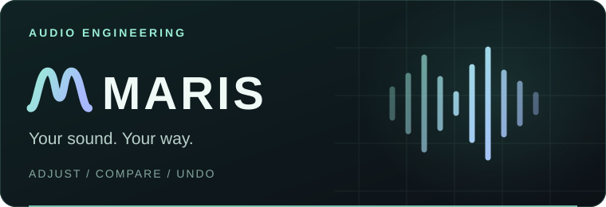

<h1 align="center">

</h1>

<!-- personal-profile:start -->

  <strong>Data Engineer &nbsp;·&nbsp; Agent Developer</strong> 
  🦀 Rustacean &nbsp;·&nbsp; 📷 Photographer &nbsp;·&nbsp; 🤖 Vibe Coder

  <a href="https://francis.run/"><strong>francis.run ↗</strong></a>
  &nbsp;·&nbsp;
  <a href="https://francis.run/about/">About me</a>
  &nbsp;·&nbsp;
  <a href="https://francis.run/gallery/">Photography</a>

I'm **Francis Du**. I work on data platforms, distributed systems and query engines, write Rust, and build tools for agents. Away from the terminal, I like to capture travel and everyday life through photography.

I'm also building a **private Data Agent project**, with a focus on retrieval, tool use, orchestration and reliability. My work includes agent engineering and evaluation. I've contributed to [Apache DataFusion](https://github.com/apache/datafusion) and [DataFusion Python](https://github.com/apache/datafusion-python).

  <a href="https://www.linkedin.com/in/francis-du/">LinkedIn</a>
  &nbsp;·&nbsp;
  <a href="https://twitter.com/francis_run">X / @francis_run</a>
  &nbsp;·&nbsp;
  <a href="https://t.me/francisdu">Telegram</a>
  &nbsp;·&nbsp;
  <a href="https://www.xiaohongshu.com/user/profile/644a0966000000001002b32b">小红书</a>
  &nbsp;·&nbsp;
  <a href="mailto:francis@francis.run">Email</a>

  
关于我 · 中文

我是 **Francis Du**，做数据工程和 Agent / Data Agent 开发，平时写 Rust、维护开源项目，也喜欢摄影。

主要和数据平台、分布式系统、查询引擎打交道。目前也在持续开发一个私有 Data Agent 项目，关注数据检索、工具调用、任务编排、可靠性与评估。参与过 Apache DataFusion 和 DataFusion Python 的开源贡献。

技术笔记写在 [francis.run](https://francis.run/)，旅途与日常收在[相册](https://francis.run/gallery/)里。

 

<!-- personal-profile:end -->

<!-- featured-projects:start -->

  <samp>BETTER TOOLS. BETTER WORKFLOWS. BETTER SOUND.</samp>

<h2 align="center">What I'm building</h2>

<table>
  <tr>
    <td width="50%" valign="top">
      
      <h3>wcode</h3>
      
<strong>Better tools for coding agents.</strong>

      
Connect your coding assistant to repository context, guarded edits and verifiable checks through MCP.

      
Code navigation · Task tracking · Revision-bound checks

      
<code>Rust</code> <code>MCP</code> <code>Apache-2.0</code>

      

        <a href="https://github.com/francis-du/wcode"><strong>Explore repo ↗</strong></a>
        &nbsp;·&nbsp;
        <a href="https://wcode.francis.run/">Website</a>
        &nbsp;·&nbsp;
        <a href="https://wcode.francis.run/docs/">Docs</a>
      

    </td>
    <td width="50%" valign="top">
      
      <h3>Maris</h3>
      
<strong>Your sound, fine-tuned.</strong>

      
Tune system audio with headphone correction, listening presets and a flexible multi-input mixer.

      
EQ &amp; presets · Dual-output mixing · Terminal &amp; MCP

      
<code>Rust</code> <code>Audio DSP</code> <code>In development</code>

      

        <a href="https://github.com/francis-du/maris"><strong>Explore repo ↗</strong></a>
        &nbsp;·&nbsp;
        <a href="https://github.com/francis-du/maris/blob/main/docs/en/index.md">Docs</a>
        &nbsp;·&nbsp;
        <a href="https://github.com/francis-du/maris/blob/main/docs/zh-CN/index.md">中文</a>
      

    </td>
  </tr>
</table>

  Maris is a development build. Public release is pending cross-platform validation.

<!-- featured-projects:end -->

<!-- beyond-code:start -->

<h2 align="center">Writing &amp; photography</h2>

<table>
  <tr>
    <td width="50%" valign="top">
      <h3>✍️ Field notes</h3>
      
Notes on Rust, agent engineering and the things I learn while building wcode.

      

        <a href="https://francis.run/blogs/"><strong>Read the blog ↗</strong></a>
        &nbsp;·&nbsp;
        <a href="https://francis.run/about/">More about me</a>
      

    </td>
    <td width="50%" valign="top">
      <h3>📷 Away from the terminal</h3>
      
Travel, everyday life and the moments I want to keep. A different way of paying attention.

      

        <a href="https://francis.run/gallery/"><strong>Browse the gallery ↗</strong></a>
        &nbsp;·&nbsp;
        <a href="https://www.xiaohongshu.com/user/profile/644a0966000000001002b32b">小红书 / Red Note</a>
      

    </td>
  </tr>
</table>

<!-- beyond-code:end -->
