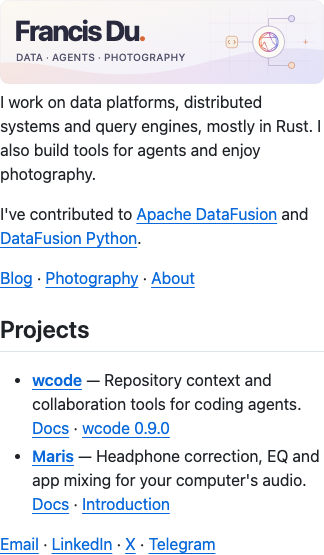

# Profile layout

One theme-aware banner, a short English introduction and two project entries. Project descriptions and links use GitHub Markdown and remain selectable text. The articles sit beside their projects; photography and all existing contact links remain accessible.

The banner uses local SVGs without scripts or external resources. GitHub supports the light/dark `<picture>` pattern in its [writing quickstart](https://docs.github.com/en/get-started/writing-on-github/getting-started-with-writing-and-formatting-on-github/quickstart-for-writing-on-github#adding-an-image-to-suit-your-visitors).

## Desktop

Actual GitHub README at [8e94249](https://github.com/francis-du/francis-du/tree/8e94249a96178cc08b0bfa5eedcedab53f003d63), captured in Chrome on 2026-10-03. These crops use GitHub's own layout, at a 1440 px viewport.

## Phone

The same README at a 390 px viewport.

## Maintenance

Keep the `personal-profile`, `featured-projects` and `beyond-code` markers. The contribution-snake workflow writes only its separate `output` branch; it must not force-push the profile's `master` branch.
